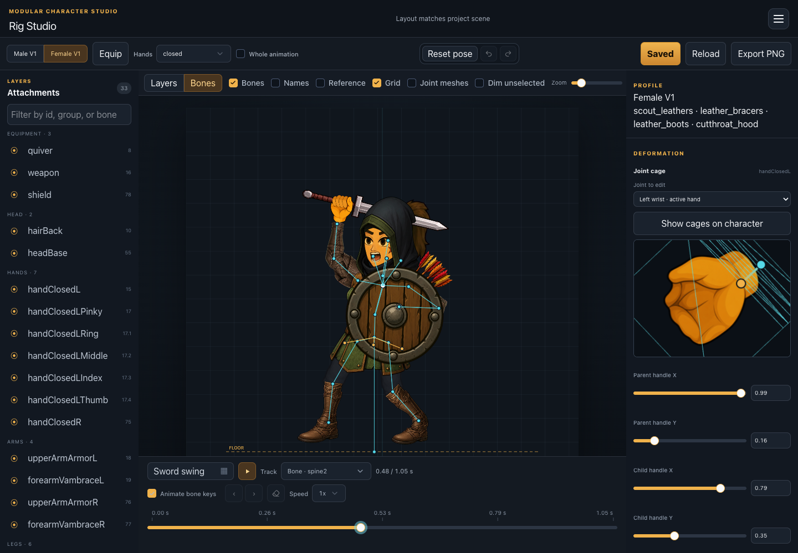
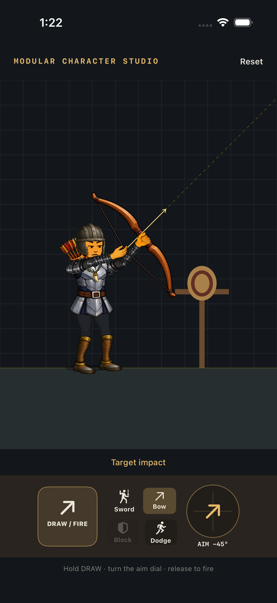

# Modular Character Studio

<table>
  <tr>
    <th width="76%">Editor · mid-sword-swing preview</th>
    <th width="24%">Native iOS demo</th>
  </tr>
  <tr>
    <td valign="top"></td>
    <td valign="top"></td>
  </tr>
</table>

A local-first editor for modular 2D cutout characters. It combines skeletal
animation, layered equipment, profile-specific fitting, hand, wrist, elbow, and
double-sided ankle deformation, and equipment previewing in one project format.

The repository starts private while its demo asset pack and portable project
format are validated.

See [TODO.md](TODO.md) for the v0.1 release plan and iOS integration work.

## Run locally

Requires Node.js 24 or newer.

```sh
npm install
npm run dev
```

Open <http://127.0.0.1:3010>. The Rig Studio and Equipment Studio share
`project/scene.json`. Saves are revision-checked, written atomically, and backed
up under `project/.history/`.

Set `MCS_PROJECT_ROOT=/absolute/path/to/project` to open another project with
the same layout.

## Bundled demo

The demo contains two body profiles, three armor directions (leather, mage,
and metal), and one sword, axe, staff, bow, and shield. The source code is MIT
licensed. The bundled demo art is CC0; see [ASSETS-LICENSE.md](ASSETS-LICENSE.md).
The retained generation prompts and their output gallery are under
[prompts/](prompts/README.md).

## Project layout

```text
project/
  scene.json
  equipment-catalog.json
  equipment-matrix.json
  assets/
```

The Rig Studio and Equipment Studio are native React routes on TanStack Start.
They share a typed, framework-independent rig core, Zustand editor state, the
same revision-protected project API, and route-scoped canvas-editor styles.

## Editor sync

The shared editor core is synced from Den Hunter (`nickick/goblin-hunter`),
`Tools/WeaponSocketEditor`, through commit `4f5e35d3f590891f414618c951d1b6647c61fbfe`.
This includes track and animation filters, timeline key authoring, whole-animation
bone offsets, equipment thumbnail matrices, elbow cages, and bow/spell carry and
movement clips. The bundled scene includes the corresponding animation tracks
and elbow meshes. Shared vambrace and boot sets use the matching Den Hunter
segment fittings for both body profiles, while demo names, art, project format,
and portable paths remain local to this repository. Catalogue thumbnails reuse bundled cutouts via
`inventoryAssetFile`, relative to `project/assets/`.

Run `npm run check` for TypeScript, editor tests, and bundled-asset validation.
Run `npm run build` to validate the production bundle.

## Playable iOS slice

On a Mac with Xcode and an iOS simulator runtime installed:

```sh
npm run export:ios
open output/ios-plate-demo/PlateDemo.xcodeproj
```

Select the **PlateDemo** scheme, choose an iPhone simulator, and press Run
(`⌘R`). The app appears as **MCS**, with its own bundled icon; the Xcode project
and scheme retain the PlateDemo name. To run on an iPhone, select your signing
team under Signing & Capabilities and choose the connected device. Use a Release
build when comparing animation performance.

The export is self-contained: a small Swift demo, the reusable `ModularCharacter`
Swift package, JSON animation/mesh data, and the plate-loadout textures. It includes
a touch-origin horizontal joystick, sword attacks, weapon switching, blocking,
dodging, and a training target. Playback uses asynchronous Canvas drawing and a
display-synchronized clock with short melee-animation transitions.

See [the iOS demo guide](examples/ios/README.md) for controls, embedding, and
export options. [The baking walkthrough](examples/ios/BAKING.md) explains how saved
rig data becomes bone samples, mesh geometry, and iOS resources. Generated files live under ignored `output/`; re-export after
saving equipment or animation edits.

The repository is also a Swift package: add it in Xcode and select the
`ModularCharacter` product to use the renderer in your own iOS app. See the
[Swift runtime API](docs/swift-runtime.md) for `CharacterLibrary`,
`ModularCharacterView`, custom-canvas rendering, and supported export features.
