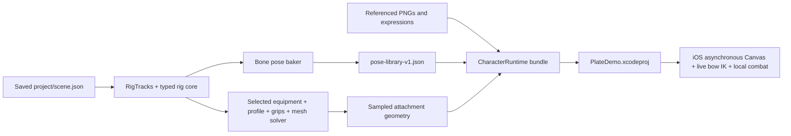

# From the editor to an iOS build

The authored project and typed rig core are the source of truth. This repository
ports Den Hunter's animation-baking approach into `scripts/bake-animation-library.mjs`
and adds a standalone resource packager, `scripts/export-ios-demo.mjs`. Neither
command imports the game checkout or needs Xcode. Node 24+ is sufficient to export;
Xcode is needed to build the resulting client.



## 1. Edit, save, and bake

```sh
npm ci
npm run dev
# Open /rig or /equipment, change a fitting or cage, and press Save.
npm run bake:poses
npm run bake:poses -- --check
```

`bake:poses` reads the saved scene and bakes all 46 currently authored clips into
`output/pose-library-v1.json`. `--samples 120` sets the number of intervals per
clip; the table includes both endpoints, so every field has 121 samples. `--check`
compares the generated bytes with the existing file and exits unsuccessfully if
the output is stale or missing. Pass the same `--samples`, `--project`, and
`--output` options when checking a custom export.

The baker samples `RigTracks.pose`, not the uncorrected procedural pose function.
That includes authored bone keys, wrist-angle keys, and clip-wide offsets.
Only fields that depart from their defaults are stored. Defaults are zero for
position/rotation and one for scale. Angles are in degrees; positions are in
authored canvas pixels. Numbers are rounded to four decimal places.

Each clip also carries `duration`, `loops`, `handPose`, `equipment`, and
`endKeyed`. A renderer advances phase using elapsed seconds / duration, wraps
looping clips, and clamps one-shot clips. Interpolate adjacent samples linearly.
For an unkeyed endpoint, hold sample N−1 until phase 1, then use sample N; the
last sample is a discrete reset, not a return transition. The exported geometry
clips and Swift demo follow the same rule.

`sampleBakedPose` is a reference implementation. The baker compares interpolated
results at quarter-, half-, and three-quarter-interval positions against the live
solver and records the worst numeric difference and its location. This report
mixes pixels, degrees, and scale according to the named channel; it is not a
pixel-perfect rendering guarantee. The current 120-sample bundle reports about
2.04 degrees at the run loop's right-knee reset boundary. Increase sampling or
review that boundary when tighter fidelity is needed.

Wrist/grip and expression keys are also retained in the pose library. Grip
channels position fingers and equipment, so they cannot be recovered from bone
matrices alone. Bone poses already contain wrist **angle** corrections; a custom
client must not add them a second time. Facial expressions select replacement
images with stepped changes, not interpolated texture values.

## 2. Package the playable loadout

```sh
npm run export:ios
# Optional:
npm run export:ios -- --profile femaleV1 --output output/ios-plate-female
npm run export:ios -- --fps 60
```

The command automatically bakes the pose library, resolves the selected plate
equipment for one body profile, and samples the 11 clips used by the playable
slice. The default geometry rate is 30 samples/second. `PLATE_LOADOUT` and
`DEMO_CLIPS` in the exporter are the explicit integration points for another
starter loadout. Custom projects must retain those item IDs or update the mapping.

The generated directory contains:

| File | Purpose |
| --- | --- |
| `PlateDemo.swift` | App entry, action bar, simulation; imports ModularCharacter |
| `PlateDemo.xcodeproj` | Ready-to-build iOS application linked to the local package |
| `ModularCharacter/` | Reusable Swift package: manifest, renderer, loader, sampler, SwiftUI view, tests, API guide, MIT license |
| `CharacterRuntime/runtime.json` | Version, source hash, profile, loadout, texture dimensions, attachment topology, clip paths, aim bone hierarchy/bind matrices and cage bind points |
| `CharacterRuntime/rig.json` | Resolved bones and layers, with the selected equipment's actual bindings and meshes |
| `CharacterRuntime/pose-library-v1.json` | General bone-pose tables for all authored animations, with wrist/grip and expression tracks |
| `CharacterRuntime/expressions.json` | The exported body's expression-to-image catalogue |
| `CharacterRuntime/clips/*.json` | Sampled matrices and deformed mesh vertices; bow clips also contain per-sample bone world matrices |
| `CharacterRuntime/assets/` | PNGs referenced by the resolved character, expression catalogue, and sampled clips |

There are three version markers: `modular-character-studio-ios-demo-v1` for the
package, `modular-character-studio-resolved-rig-v1` for the selected rig, and
`modular-character-studio-pose-library-v1` for the general pose library. Clients
should reject versions they do not support. The Swift loader validates the demo
version and checks animation geometry before displaying the arena.

Textures are copied at their original dimensions, without cropping or resizing.
This intentionally keeps pivots, finger masks, and mesh coordinates unchanged.
A future image optimizer must export original dimensions and crop offsets and
restore that logical coordinate frame when drawing; do not simply change image
sizes while keeping the same bindings.

The packager resolves both elbow segments, wrists, and both ankle segments
through the same `deformWeightedMesh` used by the browser. It also evaluates
`posedGripLayer`, torso fitting, finger Bézier masks, plane strips, and face
expression selection. Draw order is preserved. Helmet hair hiding and bow-only
held-equipment visibility are applied before sampling.

The reusable `ModularCharacter` Swift package consumes the **solved geometry**
files, and the demo imports that package. The package supplies bundle loading,
validation, interpolation, mesh drawing, and `ModularCharacterView`; the demo
supplies gameplay and controls. It does not solve the general bone pose library
at runtime. All clips carry bone world matrices for ±30° wrist limits (±5° on
the bow-holding wrist) and bow clips use a native two-arm aim solver; it updates
rigid layers and recomputes thickness-preserving
cages for the requested pitch. The arrow socket has clearance above the bow
hand, and the demo shares it between its guide and projectile origin. Live
equipment rebinding and a general raw-track solver remain separate roadmap tasks.
The drawing hand's index/ring gap, arrow nock, original masked string, and limb
flex share the draw progress. The string draws above headgear; source art is unchanged.

## 3. Build and run

Open `output/ios-plate-demo/PlateDemo.xcodeproj`, select an iPhone simulator, and
Run. For an unsigned command-line simulator build:

```sh
xcodebuild \
  -project output/ios-plate-demo/PlateDemo.xcodeproj \
  -scheme PlateDemo \
  -sdk iphonesimulator \
  -derivedDataPath output/ios-build \
  CODE_SIGNING_ALLOWED=NO build
```

For an existing client, add this repository as a Swift package, or add the
exported `ModularCharacter` directory as a local package, and link its library
product. Load `CharacterLibrary` and present `ModularCharacterView` or call the
library's `draw` API in your own canvas. The source API guide is
`docs/swift-runtime.md`; exported packages include it as `ModularCharacter/README.md`.
Add `CharacterRuntime` as a folder reference in Copy Bundle Resources. It must
keep its nested directories. Avoid renaming it to `Resources`: that name can
change how Apple interprets the app bundle layout.

Run `npm run check` for editor, bake/export, and project validation. On macOS,
the tests also compile and exercise the Swift training simulation. Run
`MCS_RUNTIME_DIRECTORY="$PWD/output/ios-plate-demo/CharacterRuntime" swift test`
after export to check the shared package against generated data. Export tests
make a temporary authored fitting/cage change and verify that it changes the
resulting runtime data, without modifying client Swift code.

After an editor save, run the export again and rebuild/relaunch the client.
The exporter operates only on saved data. Generated files are ignored by Git;
commit the authored project, exporter, Swift package sources, demo, and documentation.

## Verification limits

The slice is a horizontal training arena with a fixed armor set and sword/bow
mode switching. Body selection happens at export time. The shared Swift package
is reusable today; a live native pose solver, equipment browser, and animation
scrubber remain on the roadmap.
Simulator builds and deterministic data tests are useful evidence, but do not
replace matching browser/iPhone screenshots at the same timestamps or a physical
iPhone frame-time/memory measurement. Those release checks remain open.
