# Prompt and output gallery

These are the retained prompt records that helped create the CC0 demo pack.
Each heading links to the full historical prompt and shows the final bundled
outputs that descended from it.

The displayed PNGs are production assets, not untouched model responses. Many
were sliced from source sheets, chroma-keyed, masked, fitted, or corrected after
generation. Some outputs therefore map to more than one prompt record. The
machine-readable mapping is in [manifest.json](manifest.json).

## [Head layer sheets](records/head-layers.md)

The male and female prompts produced modular head bases, hair, and face pieces.

| Male base | Male back hair | Male front hair | Male face mark |
| --- | --- | --- | --- |
| 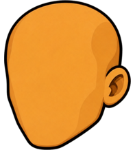 | 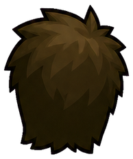 | 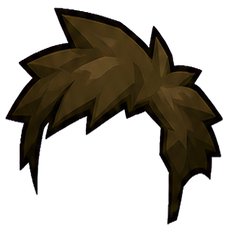 |  |
| Male eye L | Male eye R | Male brow L | Male brow R |
| 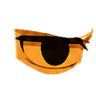 | 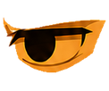 | 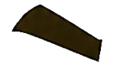 | 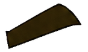 |
| Male nose | Male mouth | Female base | Female back hair |
| 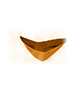 | 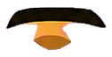 | 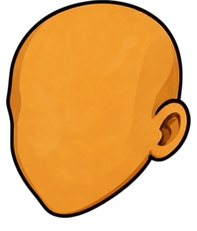 | 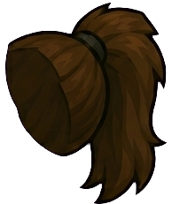 |
| Female front hair | Female face mark | Female eye L | Female eye R |
| 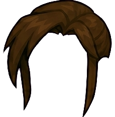 | 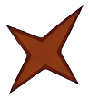 | 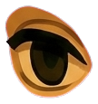 | 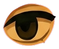 |
| Female brow L | Female brow R | Female nose | Female mouth |
| 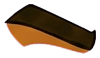 | 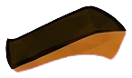 | 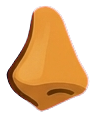 | 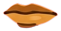 |

## [Facial-expression sheets](records/facial-expressions.md)

The prompt defines a 4-by-4 sheet per profile. These are the 16 final slices
for each body profile, in the original requested order.

### Male

| Blink L | Blink R | Wide L | Wide R |
| --- | --- | --- | --- |
|  |  | 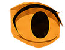 | 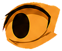 |
| Focused L | Focused R | Wince L | Wince R |
|  | 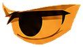 |  |  |
| Smile | Smirk | Shout | Surprised |
| 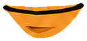 | 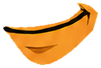 | 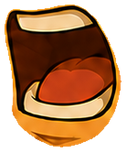 | 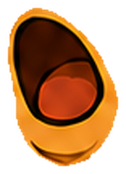 |
| Frown | Pain | Grit | Talk |
| 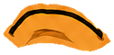 | 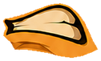 | 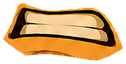 | 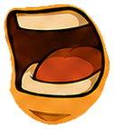 |

### Female

| Blink L | Blink R | Wide L | Wide R |
| --- | --- | --- | --- |
| 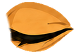 | 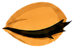 | 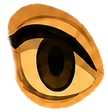 | 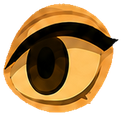 |
| Focused L | Focused R | Wince L | Wince R |
| 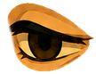 | 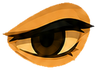 | 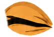 | 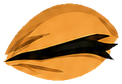 |
| Smile | Smirk | Shout | Surprised |
| 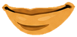 | 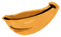 | 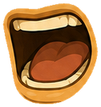 | 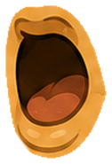 |
| Frown | Pain | Grit | Talk |
| 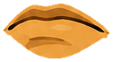 | 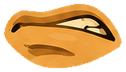 | 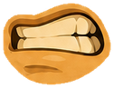 | 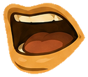 |

## [Chest armor sheets](records/chest-armor.md)

The Arcane Robes prompt is retained directly. Vanguard Plate passed through the
same two-profile chest-sheet and solid-shoulder correction workflow, but its
item-specific final prompt was not retained separately.

| Arcane robes, male | Arcane robes, female | Vanguard plate, male | Vanguard plate, female |
| --- | --- | --- | --- |
| 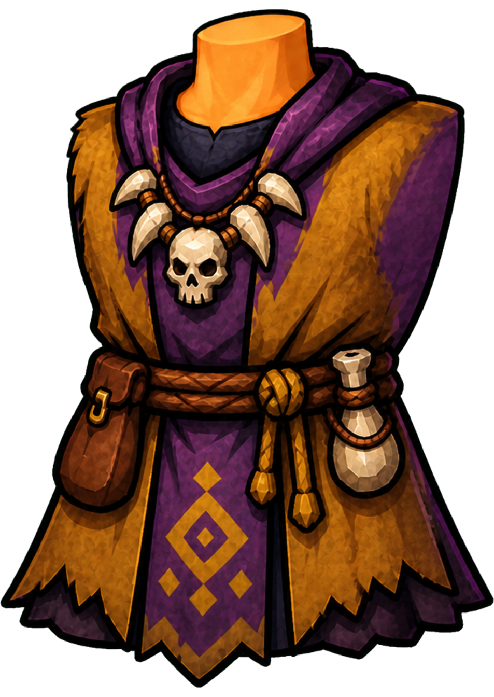 | 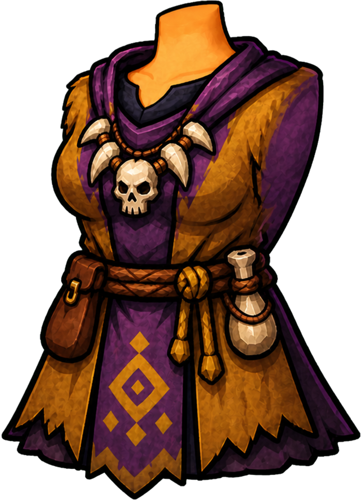 | 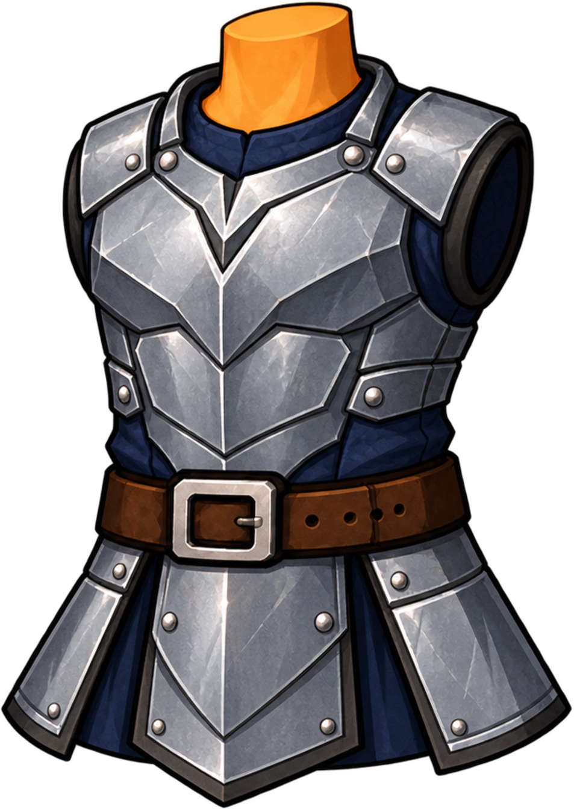 | 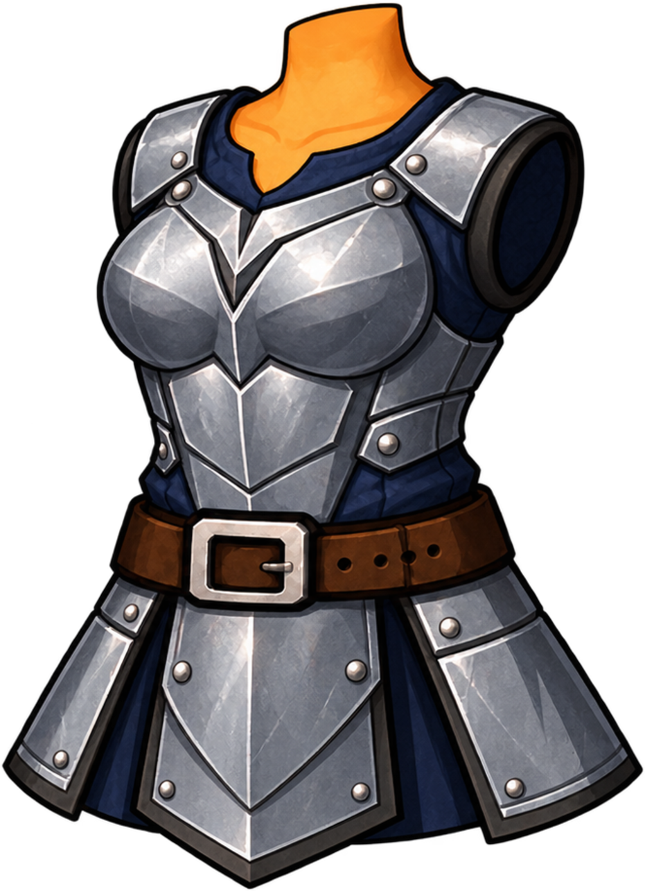 |

## [Equipment-matrix sheets](records/equipment-matrix.md)

The shared progression prompts contributed the leather outfit, articulated
bracers and boots, Cutthroat Hood, and Arcane Circlet included in the demo.

| Leather body, male | Leather body, female | Cutthroat Hood | Arcane Circlet |
| --- | --- | --- | --- |
|  |  |  |  |
| Upper arm, inside | Forearm, inside | Upper arm, outside | Forearm, outside |
|  |  |  |  |
| Boot shaft L | Boot foot L | Boot shaft R | Boot foot R |
|  |  |  |  |

## Boot sheets and corrective edits

The [boot-set prompt](records/boot-sets.md) established each four-piece design.
The later [correction prompt](records/boot-corrections.md) closed hollow shaft
and ankle openings while preserving those designs.

| Frost shaft L | Frost foot L | Frost shaft R | Frost foot R |
| --- | --- | --- | --- |
|  |  |  |  |
| Iron shaft L | Iron foot L | Iron shaft R | Iron foot R |
|  |  |  |  |

## [Simple bow](records/simple-bow.md)

## [Pendant](records/pendant.md)

## [MCS app icon](records/mcs-app-icon.md)

The generated gold articulated character is bundled in the iOS app's asset catalog.

## Assets without retained prompts

No authoritative generation prompt was retained for the bundled sword, axe,
staff, shield, ring, quiver, Arcane and plate arm sets, universal hand pieces,
neutral pants, or Vanguard Helm. They remain valid CC0 demo assets, but this
folder does not invent a history for them.
