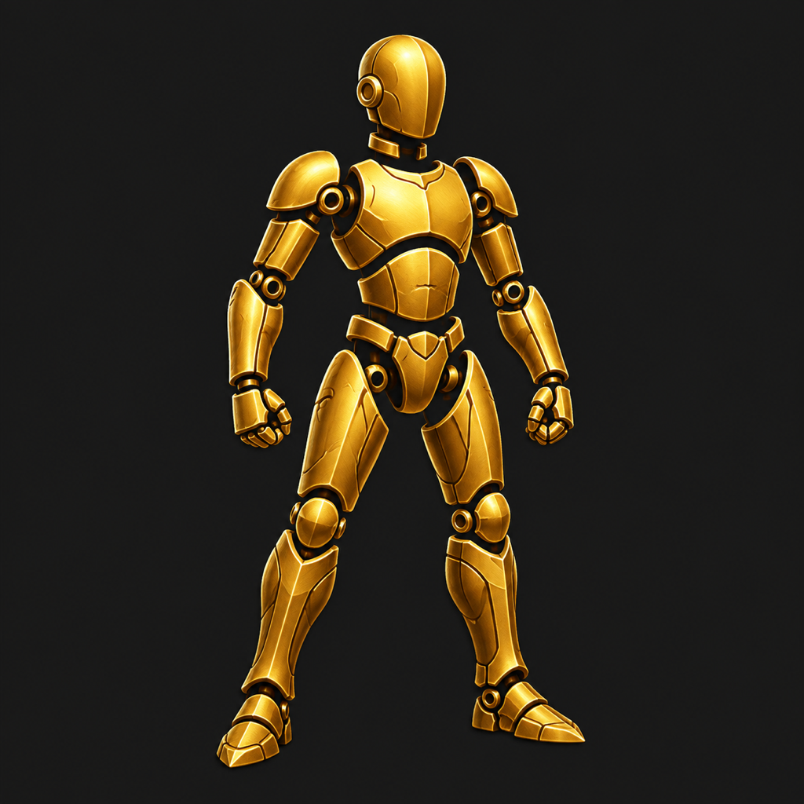

# MCS app icon

Generated with the built-in image-generation tool. Bundled artwork is CC0; see
[the asset license](../../ASSETS-LICENSE.md).



## Final prompt

```text
Use case: stylized-concept
Asset type: iOS app icon for MCS (Modular Character Studio), a modular 2D fantasy character rigging and animation tool.
Primary request: A beautifully crafted gold articulated character mannequin emblem on a dark charcoal background, suggesting interchangeable armor parts and poseable joints. Single bold figure in a balanced slightly dynamic stance, head, torso, upper arms, forearms and legs separated by clean small gaps, understated circular joint accents. Sculpted warm golden surfaces with subtle depth and highlights, crisp graphic silhouette, polished game-creation studio aesthetic matching charcoal and amber UI.
Composition: centered figure filling about 72% of the square, readable at tiny home-screen sizes; balanced safe margins.
Constraints: one 1024x1024 square image; fully opaque charcoal background extending to all four edges; no rounded outer corners, no border, no surrounding device mockup, no letters or text, no watermark, no extra props, no other characters.
```

The generated image was resized to an opaque 1024 × 1024 PNG for the iOS asset catalog.

